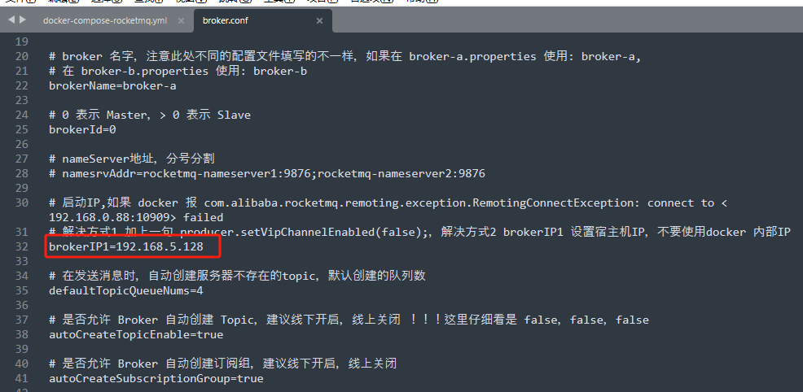
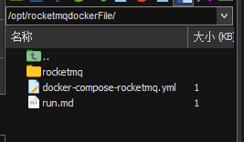
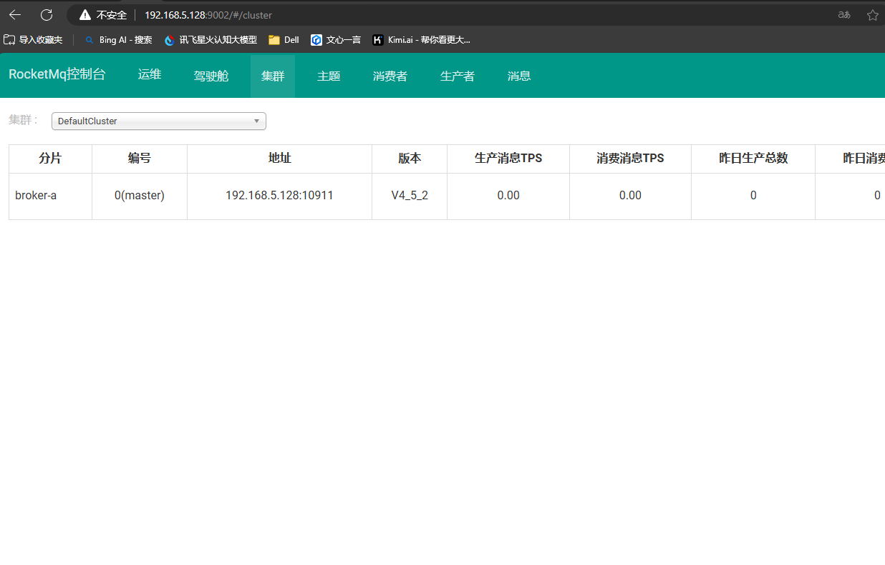

# 环境

linux

```
[root@192 ~]# uname -a
Linux 192.168.5.128 3.10.0-1160.114.2.el7.x86_64 #1 SMP Wed Mar 20 15:54:52 UTC 2024 x86_64 x86_64 x86_64 GNU/Linux

[root@192 ~]# hostnamectl
   Static hostname: localhost.localdomain
Transient hostname: 192.168.5.128
         Icon name: computer-vm
           Chassis: vm
        Machine ID: 60e0d571b62f4793afe43c8d89fa3be3
           Boot ID: 1b3f9b8d25414171b95dbf40d4245c05
    Virtualization: vmware
  Operating System: CentOS Linux 7 (Core)
       CPE OS Name: cpe:/o:centos:centos:7
            Kernel: Linux 3.10.0-1160.114.2.el7.x86_64
      Architecture: x86-64
```

docker

```
[root@192 ~]# docker -v
Docker version 26.1.0, build 9714adc
```

docker-compose

```
[root@192 ~]# docker-compose -v
Docker Compose version v2.12.2
```


# docker-compose使用

## ZIP文件

https://github.com/yupai-pai/blog/tree/main/public/docker-compose/docker-compose-rocketmq


## 修改文件

修改文件broker.conf 32行，为虚拟机的ip




## 传文件

传文件至虚拟机后cd到对应文件夹




## 执行命令

```
docker-compose -f docker-compose-rocketmq.yml -p rocketmq up -d
```


docker ps查看已运行的容器

确认rocketmq_broker、rocketmq_console_ng、rocketmq_server是启动的状态

```
[root@192 ~]# docker ps
CONTAINER ID   IMAGE                                                                   COMMAND                  CREATED         STATUS       PORTS                                                                                                                                NAMES
ba79611f496d   foxiswho/rocketmq:broker                                                "mqbroker -c /etc/ro…"   26 hours ago    Up 4 hours   0.0.0.0:10909->10909/tcp, :::10909->10909/tcp, 9876/tcp, 10912/tcp, 0.0.0.0:10911->10911/tcp, :::10911->10911/tcp                    rocketmq_broker
41912a59730d   styletang/rocketmq-console-ng                                           "sh -c 'java $JAVA_O…"   26 hours ago    Up 4 hours   0.0.0.0:9002->8080/tcp, :::9002->8080/tcp                                                                                            rocketmq_console_ng
fccea1fbae7c   foxiswho/rocketmq:server                                                "/bin/sh -c 'cd ${RO…"   26 hours ago    Up 4 hours   10909/tcp, 0.0.0.0:9876->9876/tcp, :::9876->9876/tcp, 10911-10912/tcp                                                                rocketmq_server
34cc476dca29   registry.cn-hangzhou.aliyuncs.com/zhengqing/rabbitmq:3.7.8-management   "docker-entrypoint.s…"   6 months ago    Up 4 hours   4369/tcp, 5671/tcp, 0.0.0.0:5672->5672/tcp, :::5672->5672/tcp, 15671/tcp, 25672/tcp, 0.0.0.0:15672->15672/tcp, :::15672->15672/tcp   rabbitmq
6fea87a05149   registry.cn-hangzhou.aliyuncs.com/zhengqing/redis:7.0.5                 "docker-entrypoint.s…"   12 months ago   Up 4 hours   0.0.0.0:6379->6379/tcp, :::6379->6379/tcp                                                                                            redis

```


## 访问

访问地址：[`http://ip地址:9002`](http://www.zhengqingya.com:9002)


