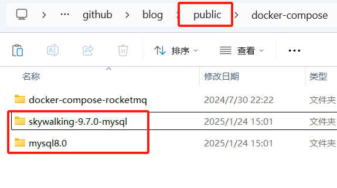
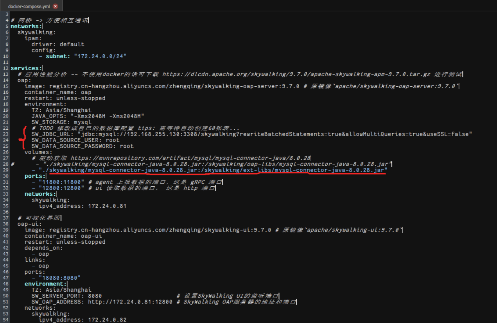
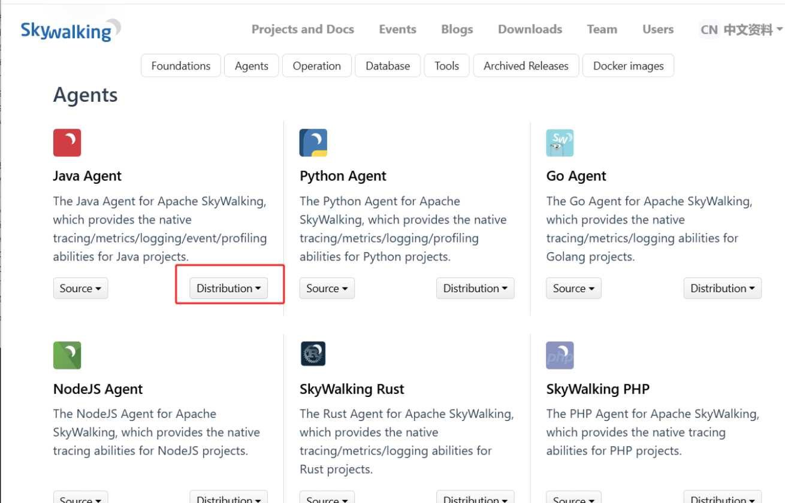
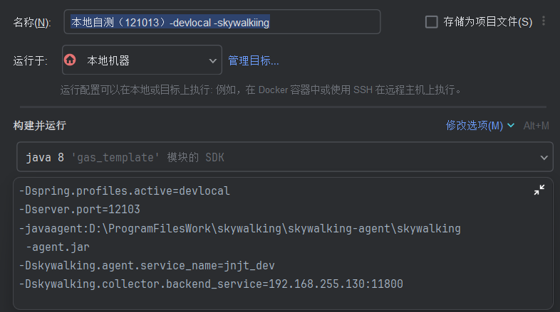
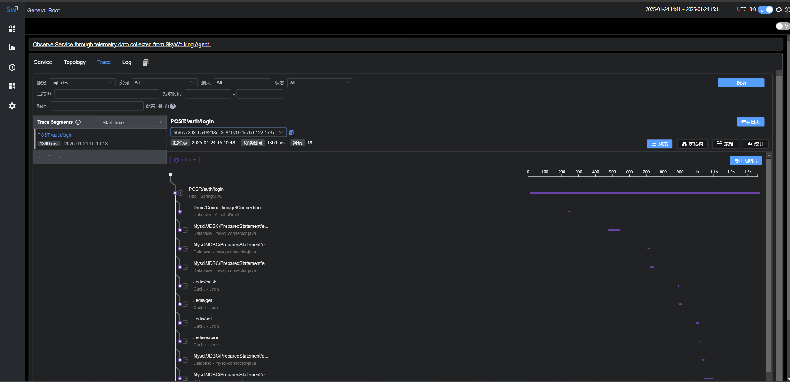

# 介绍

SkyWalking 极简入门

https://skywalking.apache.org/zh/2020-04-19-skywalking-quick-start/


SkyWalking 文档中文版

https://github.com/SkyAPM/document-cn-translation-of-skywalking


# 环境配置

docker

docker-compose

mysql8

skywalking

skywalking-agent





# 环境部署

[docker-compose](https://gitee.com/zhengqingya/docker-compose)

https://gitee.com/zhengqingya/docker-compose/tree/master/Linux

使用compose配置环境时

需要先有一个mysql 80的环境，创建对应的数据库

把数据库url连接进行变更，再初始化docker环境




注：

- skywalking-agent版本需要和skywalking版本保持一致
- 最好用mysql版，es太吃内存了，虚拟机带不动
- skywalking-agent最好下编译之后的版本，vm虚拟机参数指定jar时（有些版本单个jar包可以，有些版本不行）需要整个文件夹都放进去，单个会报找不到jar包的配置文件
- 如果要采集到日志需要添加上logback相关依赖
- 使用链路追踪java程序本身会变慢


# JAVA使用


**skywalking-agent**

下载地址

有编译好的版本，和源码版，最好选编译后的版本

https://skywalking.apache.org/downloads/




**运行**

运行时给java虚拟机添加参数

```
-javaagent:C:\Users\yusiyang\Desktop\890\skywalking-agent\skywalking-agent.jar
-Dskywalking.agent.service_name=demo-application22
-Dskywalking.collector.backend_service=192.168.5.128:11800
```




**查看链路**

1、请求接口

2、浏览页面打开ui网址：http://192.168.255.130:18080/



