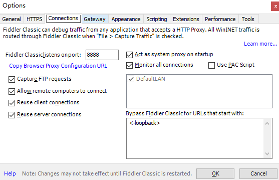
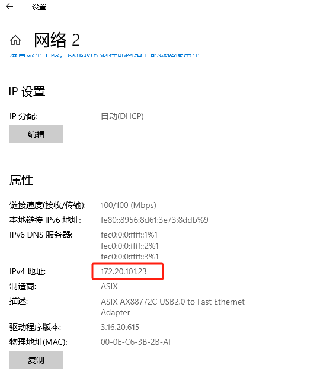
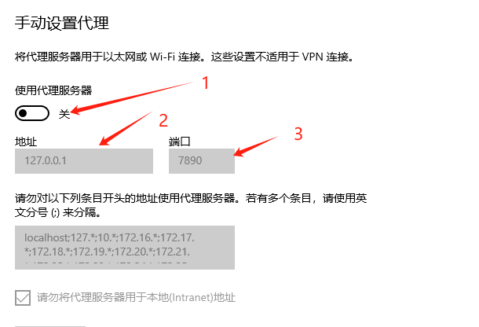

最近开发变成了纯内网开发，当前项目是APP项目需要手机连内网进行真机测试，手机连内网之前用的inode，inode使用被禁，只能通过电脑连线网线进入到内网，手机也需要内网所以有了一下教程

理论上使用电脑连内网+代理技术都能做到，这个笔记里选用的是fiddler 经其他技术人员测试也可以用nginx

1、

电脑未连接inode(VPN)状态下

进入win设置--网络和internet--移动热点--打开热点--使用真机进行连接

（顺序不能颠倒，先用网线连内网再开热点，热点无法打开）

2、

电脑连接inode进入内网

打开fiddler软件--工具--选项 配置如下点ok

3、

查看电脑1ip 为172.20.101.23

4、

手机真机访问，172.20.101.23:8888 端口，下载信任证书，进行安装

5、

Fiddler在电脑端需要常开不能关闭

6、

手机就可以访问内网网页

注：

如果电脑2想连电脑1wifi进入内网

需要在电脑2--网络和internet--代理--手动设置代理

1打开

2电脑1 ip地址

3端口设置为 8888

常见问题：

1、电脑连不上互联网

把电脑的代理去掉就可以了

2、手机连不上互联网

把手机、高级设置，里面的手动代理取消

3、电脑插上有线网后无法分享热点

需要先分享，再插有线网线

