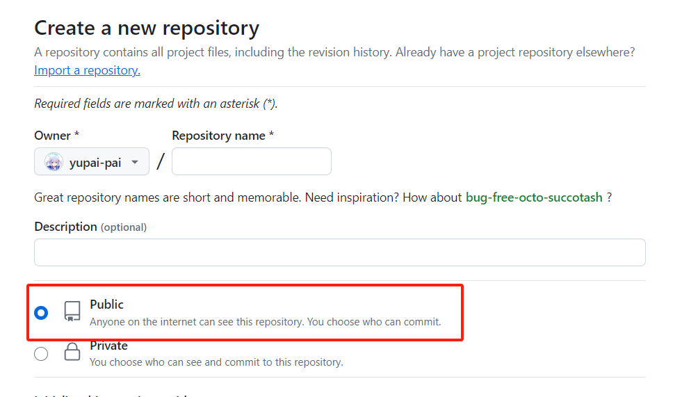
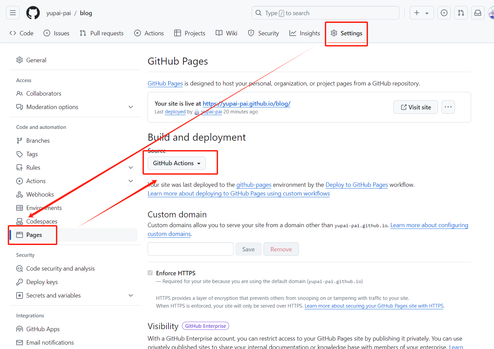
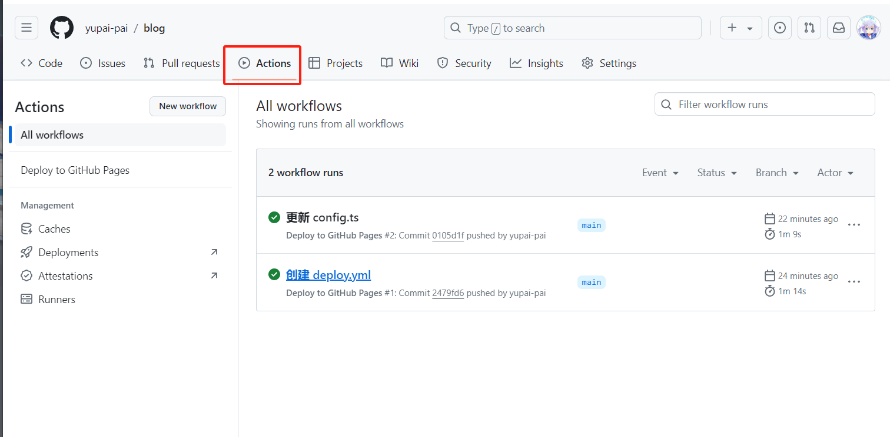

# 开源链接

https://github.com/saicaca/fuwari    谢谢大佬们


# 步骤

**1、创建仓库**

登录github创建公开仓库



---


2、克隆仓库到本地电脑


3、https://github.com/saicaca/fuwari  打开开源地址，下载开源代码复制代码到创建的git仓库


4、修改astro.config.mjs配置文件

‪D:\Code\github\blog\astro.config.mjs

site:yupai-pai替换为自己的github用户名

base:blog替换为自己的仓库名字

```
export default defineConfig({
  site: "https://yupai-pai.github.io",
  base: "/blog",
  trailingSlash: "always",
```


5、根据自己的需求修改config.ts配置文件

里面可以设置语言，超链接地址等等


6、创建构建文件

创建创建.github，workflows文件夹

创建deploy.yml构建文件

创建好后层级如下

```
‪D:\Code\github\blog\.github\workflows\deploy.yml
```

把下面配置复制进yml中

```
name: Deploy to GitHub Pages

on:
  # 每次推送到 `main` 分支时触发这个“工作流程”
  # 如果你使用了别的分支名，请按需将 `main` 替换成你的分支名
  push:
    branches: [ main ]
  # 允许你在 GitHub 上的 Actions 标签中手动触发此“工 作流程”
  workflow_dispatch:

# 允许 job 克隆 repo 并创建一个 page deployment
permissions:
  contents: read
  pages: write
  id-token: write

jobs:
  build:
    runs-on: ubuntu-latest
    steps:
      - name: Checkout your repository using git
        uses: actions/checkout@v4
      - name: Install, build, and upload your site
        uses: withastro/action@v2
        with:
          path: . # 存储库中 Astro 项目的根位置。（可选）
          node-version: 20 # 用于构建站点的特定 Node.js 版本，默认为 20。（可选）
          package-manager: pnpm@latest # 应使用哪个 Node.js 包管理器来安装依赖项和构建站点。会根据存储库中的 lockfile 自动检测。（可选）

  deploy:
    needs: build
    runs-on: ubuntu-latest
    environment:
      name: github-pages
      url: ${{ steps.deployment.outputs.page_url }}
    steps:
      - name: Deploy to GitHub Pages
        id: deployment
        uses: actions/deploy-pages@v4
```


7、github进入仓库-设置-pages

设置为github Actions，保存




8、git提交代码到远程仓库


9、构建成功后就能访问了

查看构建情况在项目Actions，如果有报错也可以在这里看




10、构建成功后访问地址为

其中yupai-pai为用户名

blog为仓库地址

https://yupai-pai.github.io/blog/
