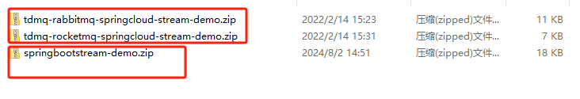

# 项目需求

开发的项目进行上线，有的项目库用rocketmq或rabbitmq作为中间件

需求就是需要配置开关开发到通用版进行切换中间件

前期调研有两种方案可以实现

1、控制注入springboot bean进行控制

2、使用springboot  stream框架实现


以下是两种实现方式代码


# Bean方案

## 1、pom引入

```
        <dependency>
            <groupId>org.springframework.boot</groupId>
            <artifactId>spring-boot-starter-amqp</artifactId>
        </dependency>
        <dependency>
            <groupId>org.apache.rocketmq</groupId>
            <artifactId>rocketmq-spring-boot-starter</artifactId>
            <version>2.0.4</version>
        </dependency>
```


## 2、yml配置 

```
# 公共配置文件
spring:
  application:
    name: XXX
  config:
    activate:
      on-profile: XXX
  rabbitmq:
    host: XXX
    password: XXX
    port: 5672
    username: XXX
    virtual-host: /
    listener:
      simple:
        acknowledge-mode: manual
      direct:
        acknowledge-mode: manual
XX:
  rabbitmq:
    XXXQueueExchange: XXX
    XXXQueue: XXX.XXX
    XXXExchange: XXX
    XXXQueue: XXX.XXX
  rocketmq:
    XXXTopic: XXX
    XXXQueueGroup: XXX #rocketmq队列名称不能带.符号
    XXXTopic: XXX
    XXXQueueGroup: XXX
rocketmq:
  name-server: 192.168.5.128:9876 # 访问地址
```


## 3、加入注解

在MainApplication中加入注解
```
@SpringBootApplication(exclude = {RabbitAutoConfiguration.class, RocketMQAutoConfiguration.class})
```


## 4、根据条件注册bean

rabbitmq

```
import org.springframework.boot.autoconfigure.amqp.RabbitAutoConfiguration;
import org.springframework.boot.autoconfigure.condition.ConditionalOnProperty;
import org.springframework.context.annotation.Configuration;
 
/**
 * @desccription 自定义RabbitMQ的启动配置类，可以通过配置变量来控制启用、禁用
 */
@Configuration
@ConditionalOnProperty(name = "XX.messageQueue", havingValue = "rabbitmq")
public class MyRabbitAutoConfiguration extends RabbitAutoConfiguration {
}
```


rocketmq

```
import org.apache.rocketmq.spring.autoconfigure.RocketMQAutoConfiguration;
import org.springframework.boot.autoconfigure.condition.ConditionalOnProperty;
import org.springframework.context.annotation.Configuration;

@Configuration
@ConditionalOnProperty(name = "XX.messageQueue", havingValue = "rocketmq")
public class MyRocketMQAutoConfiguration extends RocketMQAutoConfiguration {
}
```


## 5、mq消费

rabbitmq消费

```
package com.haote.iis.mq;

import com.alibaba.fastjson2.JSONPath;
import com.haote.iis.utils.IisUtils;
import com.rabbitmq.client.Channel;
import lombok.SneakyThrows;
import lombok.extern.slf4j.Slf4j;
import org.springframework.amqp.core.Message;
import org.springframework.amqp.rabbit.annotation.RabbitHandler;
import org.springframework.amqp.rabbit.annotation.RabbitListener;
import org.springframework.boot.autoconfigure.condition.ConditionalOnProperty;
import org.springframework.stereotype.Component;
import javax.annotation.Resource;

@Slf4j
@Component
@ConditionalOnProperty(name = "XX.messageQueue", havingValue = "rabbitmq")
public class MyRabbitMqDnyFlightConsumer {
    @RabbitListener(queues = "${XX.rabbitmq.XXQueue}")
    public void handleMessage(Message message, Channel channel) {
        String msg = new String(message.getBody());
        if(!IisUtils.isJson(msg)){
            channel.basicAck(message.getMessageProperties().getDeliveryTag(), false);
	}
  }
}
```


rocketmq消费

```
import com.alibaba.fastjson2.JSONPath;
import com.haote.iis.utils.IisUtils;
import lombok.extern.slf4j.Slf4j;
import org.apache.rocketmq.spring.annotation.RocketMQMessageListener;
import org.apache.rocketmq.spring.core.RocketMQListener;
import org.springframework.boot.autoconfigure.condition.ConditionalOnProperty;
import org.springframework.stereotype.Service;

import javax.annotation.Resource;

@Service
@Slf4j
@ConditionalOnProperty(name = "XX.messageQueue", havingValue = "rocketmq")
@RocketMQMessageListener(topic = "${XX.rocketmq.XXTopic}"
        ,consumerGroup = "${XX.rocketmq.XXQueueGroup}")
public class MyRocketMqDnyFlightConsumer implements RocketMQListener<String> {
    @Override
    public void onMessage(String msg) {
        if(!IisUtils.isJson(msg)){
            log.info("rocketmq消息：内容为{},非法json消息不处理", msg);
            return;
        }
    }
}
```


## 6、问题

在rabbitmq消费时

要求在代码中进行创建队列，当创建return new TopicExchange(noticeExchange, true, false);这种临时队列时需要用到随机数，存入变量中 创建和监控都要使用该变量

在注解中进行Listener监控时里面的值必须是常量

尝试使用springboot  yml中配置、${random.int(1, 100)}变量，然后通过自动注入进行获取 在Listener监控时两次获取的的值不一致报队列不存在

最后解决方式为

通过以下代码注入到springboot

```
import cn.hutool.core.util.IdUtil;
import org.springframework.beans.factory.annotation.Value;
import org.springframework.boot.autoconfigure.condition.ConditionalOnProperty;
import org.springframework.context.annotation.Bean;
import org.springframework.stereotype.Component;

@Component
public class XXXConfiguration {
    @Value("${XXX.rabbitmq.XXXQueue}")
    String XXXQueue;

    @Bean
    @ConditionalOnProperty(name = "XX.messageQueue", havingValue = "rabbitmq")
    public String XXXQueueName() {
        return XXXQueue + "_" +IdUtil.objectId();
    }
}
```


监听代码

```
    @RabbitListener(queues = "#{XXXQueueName}")
    @RabbitHandler(isDefault = true)
    public void handleMessage(Message msg, Channel channel) {XXX}
```


创建队列代码

```
    @Value("#{obcsQueueName}")
    private String XXXQueueName;
```

```
	@Bean
    public Queue XXXQueue() {
        return new Queue(XXXQueueName, false, true, true);
    }
```


# springboot-Stream方案

参考demo代码

在public文件夹下面搜下图文件



注:

前两个是网上下载的demo

最后一个是自己写的demo，其中application-rocketmq.yml中的配置验证未通过，需要配置成tdmq-rocketmq-springcloud-stream-demo.zip中的yml配置。更改配置后就可以实现这个需求了。


